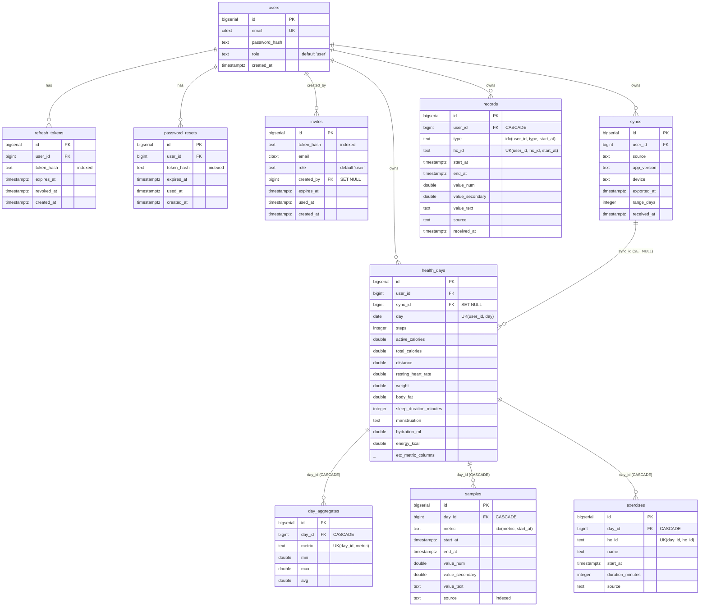

# Vitalix Server — Database ERD

Schema for the self-hosted Vitalix receiver (`web/`). PostgreSQL, managed by
`node-pg-migrate`. This doc is derived from the migrations in
`web/migrations/` — those files are the source of truth; update this doc when
they change.

Migration order:

1. `1721520000000_init.cjs` — health data tables (`syncs`, `health_days`, `day_aggregates`, `samples`, `exercises`)
2. `1721600000000_auth.cjs` — auth tables (`users`, `refresh_tokens`, `password_resets`, `invites`) + adds `user_id` to health data
3. `1721700000000_sample_source.cjs` — adds `source` to `samples`/`exercises`
4. `1721800000000_records.cjs` — raw per-reading `records` table + `hc_id` on `exercises`

## Diagram

## Table reference

### `users`
Account records. `email` is `citext` (case-insensitive) and unique. `role` is
`user` or `admin` (see `scripts/create-admin.js`). Root of all per-user data —
deleting a user cascades to their tokens, syncs, health days, and records.

### `refresh_tokens` / `password_resets`
Same shape (built by the `tokenTable` helper): `user_id` FK (CASCADE),
`token_hash` (indexed — tokens are stored hashed, never plaintext),
`expires_at`, `created_at`. `refresh_tokens` adds `revoked_at`;
`password_resets` adds `used_at`. Both are consumed by `src/auth/tokens.js`.

### `invites`
Admin-issued signup invites. `token_hash` (indexed), target `email` + `role`,
`created_by` FK to the issuing user (SET NULL on delete), `expires_at`,
`used_at`.

### `syncs`
One row per upload from the Android app. Metadata about the payload: `source`,
`app_version`, `device`, `exported_at` (device clock), `range_days`,
`received_at` (server clock). `user_id` FK (CASCADE). Referenced by
`health_days.sync_id` (SET NULL — deleting a sync keeps the day rollup).

### `health_days`
**Per-day rollup, one row per `(user_id, day)`** (unique constraint
`health_days_user_day_key`). Wide table: ~30 nullable metric columns (steps,
calories, distance, VO2 max, body measurements, resting HR, body temperature,
sleep phase minutes, reproductive-health text fields, hydration, energy). Only
user-enabled metrics are populated; the rest stay NULL. Upserted per sync.

### `day_aggregates`
Min/max/avg triples for metrics that aggregate over a day. `day_id` FK
(CASCADE), unique on `(day_id, metric)`. Maps to the `MinMaxAvg` model.

### `samples`
Intraday readings attached to a day. `day_id` FK (CASCADE), `metric`,
`start_at`/`end_at`, `value_num`/`value_secondary`/`value_text`, `source`
(Health Connect `dataOrigin` package name). Indexed on `(metric, start_at)`,
`day_id`, and `source`. Legacy granular store — parallel to `records`.

### `exercises`
Workout sessions per day. `day_id` FK (CASCADE), `name`, `start_at`,
`duration_minutes`, `source`, `hc_id`. Unique on `(day_id, hc_id)`
(`exercises_identity`) so re-syncs upsert instead of duplicating.

### `records`
**Raw per-reading store at native Health Connect granularity** — the modern
source of truth, parallel to `samples`. Keyed on the Health Connect record UID:
unique `(user_id, hc_id, start_at)` (`records_identity`) so overlapping backfill
windows and re-syncs upsert rather than duplicate. `type` distinguishes record
kinds; indexed on `(user_id, type, start_at)`. Not linked to `health_days` —
owned directly by `user`.

## Notes

- **Two granular stores exist**: `samples` (day-scoped, older) and `records`
  (user-scoped, UID-keyed, idempotent). New granular ingestion targets
  `records`; the `/api/records` endpoint reads from it and derives bucketed
  series (see `src/records.js`, `src/chartData.js`).
- **Cascade behavior**: deleting a `user` wipes all their data. Deleting a
  `sync` nulls `health_days.sync_id` but keeps the day. Deleting a
  `health_days` cascades to its aggregates, samples, and exercises.
- **All tokens are hashed at rest** — `token_hash` columns never hold
  plaintext.
