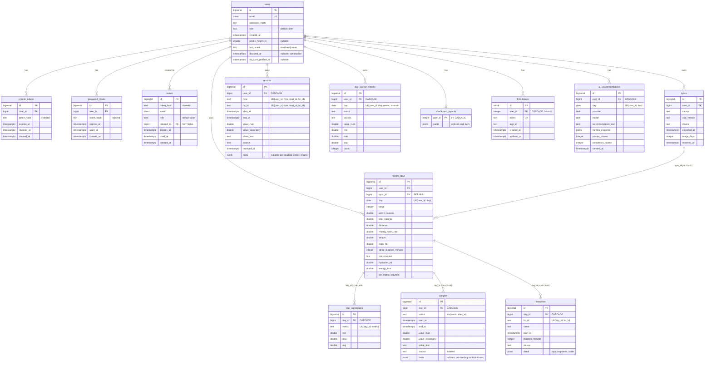

# Vitalix Server — Database ERD

Schema for the self-hosted Vitalix receiver (`web/`). PostgreSQL 18, migrated by
the in-repo runner `web/src/migrate.js` (applied automatically on server start,
ledger in `schema_migrations`). The SQL files in `web/db/migrations/` are the
source of truth; update this doc when they change.

| # | Migration | Change |
|---|-----------|--------|
| 001 | `init` | health data: `syncs`, `health_days`, `day_aggregates`, `samples`, `exercises` |
| 002 | `auth` | `users`, `refresh_tokens`, `password_resets`, `invites`; `user_id` on health data |
| 003 | `sample_source` | `source` on `samples` / `exercises` |
| 004 | `records` | raw per-reading `records`; `hc_id` on `exercises` |
| 005 | `day_source_metrics` | per-source daily rollup (+ backfill from `records`) |
| 006 | `reading_meta` | `meta jsonb` on `samples` / `records` |
| 007 | `exercise_detail` | `detail jsonb` on `exercises` (laps, segments, GPS route) |
| 008 | `dashboard_layouts` | per-user dashboard card order |
| 009 | `user_profile` | `users.profile_height_m`, `users.bmi_scale` |
| 010 | `strip_source_hash` | data fix: drop `#…` suffix from source package names |
| 011 | `user_disabled` | `users.disabled_at` (soft disable) |
| 012 | `fcm_tokens` | device push tokens |
| 013 | `ai_recommendations` | daily AI insight per user/day (also added `users.ai_config`, dropped in 016) |
| 014 | `no_sync_notify` | `users.no_sync_notified_at` (stale-sync push dedup) |
| 015 | `records_identity_type` | `records` identity → `(user_id, type, start_at, hc_id)` |
| 016 | `drop_user_ai_config` | drop unused `users.ai_config` (AI config is server-wide env) |

## Diagram

```mermaid
erDiagram
    users ||--o{ refresh_tokens : "has"
    users ||--o{ password_resets : "has"
    users ||--o{ invites : "created_by"
    users ||--o{ syncs : "owns"
    users ||--o{ health_days : "owns"
    users ||--o{ records : "owns"
    users ||--o{ day_source_metrics : "owns"
    users ||--o| dashboard_layouts : "has"
    users ||--o{ fcm_tokens : "has"
    users ||--o{ ai_recommendations : "has"

    syncs ||--o{ health_days : "sync_id (SET NULL)"

    health_days ||--o{ day_aggregates : "day_id (CASCADE)"
    health_days ||--o{ samples : "day_id (CASCADE)"
    health_days ||--o{ exercises : "day_id (CASCADE)"

    users {
        bigserial id PK
        citext email UK
        text password_hash
        text role "default 'user'"
        timestamptz created_at
        double profile_height_m "nullable"
        text bmi_scale "standard | asian"
        timestamptz disabled_at "nullable; soft disable"
        timestamptz no_sync_notified_at "nullable"
    }

    refresh_tokens {
        bigserial id PK
        bigint user_id FK
        text token_hash "indexed"
        timestamptz expires_at
        timestamptz revoked_at
        timestamptz created_at
    }

    password_resets {
        bigserial id PK
        bigint user_id FK
        text token_hash "indexed"
        timestamptz expires_at
        timestamptz used_at
        timestamptz created_at
    }

    invites {
        bigserial id PK
        text token_hash "indexed"
        citext email
        text role "default 'user'"
        bigint created_by FK "SET NULL"
        timestamptz expires_at
        timestamptz used_at
        timestamptz created_at
    }

    syncs {
        bigserial id PK
        bigint user_id FK
        text source
        text app_version
        text device
        timestamptz exported_at
        integer range_days
        timestamptz received_at
    }

    health_days {
        bigserial id PK
        bigint user_id FK
        bigint sync_id FK "SET NULL"
        date day "UK(user_id, day)"
        integer steps
        double active_calories
        double total_calories
        double distance
        double resting_heart_rate
        double weight
        double body_fat
        integer sleep_duration_minutes
        text menstruation
        double hydration_ml
        double energy_kcal
        _ etc_metric_columns
    }

    day_aggregates {
        bigserial id PK
        bigint day_id FK "CASCADE"
        text metric "UK(day_id, metric)"
        double min
        double max
        double avg
    }

    samples {
        bigserial id PK
        bigint day_id FK "CASCADE"
        text metric "idx(metric, start_at)"
        timestamptz start_at
        timestamptz end_at
        double value_num
        double value_secondary
        text value_text
        text source "indexed"
        jsonb meta "nullable; per-reading context enums"
    }

    exercises {
        bigserial id PK
        bigint day_id FK "CASCADE"
        text hc_id "UK(day_id, hc_id)"
        text name
        timestamptz start_at
        integer duration_minutes
        text source
        jsonb detail "laps, segments, route"
    }

    records {
        bigserial id PK
        bigint user_id FK "CASCADE"
        text type "UK(user_id, type, start_at, hc_id)"
        text hc_id "UK(user_id, type, start_at, hc_id)"
        timestamptz start_at
        timestamptz end_at
        double value_num
        double value_secondary
        text value_text
        text source
        timestamptz received_at
        jsonb meta "nullable; per-reading context enums"
    }

    day_source_metrics {
        bigserial id PK
        bigint user_id FK "CASCADE"
        date day "UK(user_id, day, metric, source)"
        text metric
        text source
        double value_num
        double min
        double max
        double avg
        integer count
    }

    dashboard_layouts {
        integer user_id PK "FK CASCADE"
        jsonb cards "ordered card keys"
    }

    fcm_tokens {
        serial id PK
        integer user_id FK "CASCADE, indexed"
        text token UK
        text app_id
        timestamptz created_at
        timestamptz updated_at
    }

    ai_recommendations {
        bigserial id PK
        bigint user_id FK "CASCADE"
        date day "UK(user_id, day)"
        text provider
        text model
        text recommendation_text
        jsonb metrics_snapshot
        integer prompt_tokens
        integer completion_tokens
        timestamptz created_at
    }
```

## Table reference

### `users`
Account records. `email` is `citext` (case-insensitive) and unique. `role` is
`user` or `admin` (see `scripts/create-admin.js`). Root of all per-user data —
deleting a user cascades to their tokens, syncs, health days, and records.
`disabled_at` soft-disables an account (login, refresh and every authenticated
request are refused; data is kept). `profile_height_m` / `bmi_scale` come from the
app payload and back the BMI card when Health Connect has no height.
`no_sync_notified_at` dedups the stale-sync push.

### `refresh_tokens` / `password_resets`
Same shape (built by the `tokenTable` helper): `user_id` FK (CASCADE),
`token_hash` (indexed — tokens are stored hashed, never plaintext),
`expires_at`, `created_at`. `refresh_tokens` adds `revoked_at`;
`password_resets` adds `used_at`. Both are consumed by `src/auth/tokens.js`.

### `invites`
Admin-issued signup invites. `token_hash` (indexed), target `email` + `role`,
`created_by` FK to the issuing user (SET NULL on delete), `expires_at`,
`used_at`.

### `syncs`
One row per upload from the Android app. Metadata about the payload: `source`,
`app_version`, `device`, `exported_at` (device clock), `range_days`,
`received_at` (server clock). `user_id` FK (CASCADE). Referenced by
`health_days.sync_id` (SET NULL — deleting a sync keeps the day rollup).

### `health_days`
**Per-day rollup, one row per `(user_id, day)`** (unique constraint
`health_days_user_day_key`). Wide table: ~30 nullable metric columns (steps,
calories, distance, VO2 max, body measurements, resting HR, body temperature,
sleep phase minutes, reproductive-health text fields, hydration, energy). Only
user-enabled metrics are populated; the rest stay NULL. Upserted per sync.

### `day_aggregates`
Min/max/avg triples for metrics that aggregate over a day. `day_id` FK
(CASCADE), unique on `(day_id, metric)`. Maps to the `MinMaxAvg` model.

### `samples`
Intraday readings attached to a day. `day_id` FK (CASCADE), `metric`,
`start_at`/`end_at`, `value_num`/`value_secondary`/`value_text`, `source`
(Health Connect `dataOrigin` package name). Indexed on `(metric, start_at)`,
`day_id`, and `source`. Legacy granular store — parallel to `records`.

`meta` (jsonb, nullable) — per-reading Health Connect context enums
(`bodyPosition`, `mealType`, `measurementMethod`, …). `NULL` when the reading carries no context.

### `exercises`
Workout sessions per day. `day_id` FK (CASCADE), `name`, `start_at`,
`duration_minutes`, `source`, `hc_id`. Unique on `(day_id, hc_id)`
(`exercises_identity`) so re-syncs upsert instead of duplicating.

### `exercises.detail`
`jsonb` `{ laps, segments, route }` — set when the session carried any of them
(`route` needs the exercise-route grant); `NULL` otherwise.

### `dashboard_layouts`
One row per user who customized the dashboard: `cards` is the ordered list of
card keys. No row = default layout (every card with data).

### `fcm_tokens`
Firebase Cloud Messaging device tokens, registered by the app on open
(`POST /api/fcm/register`). Unique `token`; tokens that FCM reports as
unregistered are pruned when a push fails.

### `ai_recommendations`
Cached daily insight per `(user_id, day)`: the LLM text plus the
`metrics_snapshot` it was generated from, provider/model, and token counts.
Written by `/api/ai/recommendations/generate` and the daily-insights cron.

### `records`
**Raw per-reading store at native Health Connect granularity** — the modern
source of truth, parallel to `samples`. Keyed on the Health Connect record UID:
unique `(user_id, type, start_at, hc_id)` (`records_identity`, migration 015) so
overlapping backfill windows and re-syncs upsert rather than duplicate. `type` is
part of the key because one NutritionRecord fans out into several rows (one per
nutrient) sharing `hc_id` + `start_at`; the same index serves range queries. Not linked to `health_days` —
owned directly by `user`.

`meta` (jsonb, nullable) — per-reading Health Connect context enums
(`bodyPosition`, `mealType`, `measurementMethod`, …). Populated at ingest from
the sample's `meta` object; `NULL` when the reading carries no context.

### `day_source_metrics`
**Per-source daily rollup** — one representative value per
`(user_id, day, metric, source)` (unique `day_source_metrics_identity`).
Populated at ingest from the mapped samples (`rollupSourceMetrics` in
`records.js`) and backfilled from `records`. `metric` uses the `records.type`
camelCase vocabulary. Powers the dashboard's source filter and per-source
overlay lines; `value_num` is the per-source daily value (sum / last / avg per
the metric's aggregation rule), with `min`/`max`/`avg` set for distribution
metrics. Indexed on `(user_id, metric, day)`.

## Notes

- **Two granular stores exist**: `samples` (day-scoped, older) and `records`
  (user-scoped, UID-keyed, idempotent). New granular ingestion targets
  `records`; the `/api/records` endpoint reads from it and derives bucketed
  series (see `src/records.js`, `src/chartData.js`).
- **Cascade behavior**: deleting a `user` wipes all their data. Deleting a
  `sync` nulls `health_days.sync_id` but keeps the day. Deleting a
  `health_days` cascades to its aggregates, samples, and exercises.
- **Known debt**: `dashboard_layouts.user_id` and `fcm_tokens.user_id` are
  `integer` while `users.id` is `bigint`; `samples` duplicates `records` and is
  slated for removal once the dashboard reads only from `records`.
- **All tokens are hashed at rest** — `token_hash` columns never hold
  plaintext.
